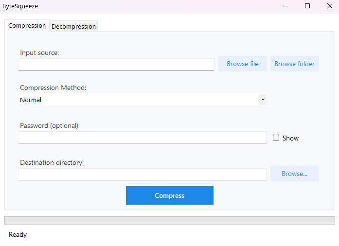

A powerful file compression application built with C# and Windows Forms, featuring a **from-scratch implementation** of the **DEFLATE** algorithm with multiple compression levels and optional **AES-256** encryption.

> **Senior Project** — Developed as a capstone project demonstrating expertise in data compression algorithms, cryptography, and Windows desktop application development.

### Highlights
- **Custom Implementation** — The core compression algorithm is built entirely from scratch with **no external compression libraries**
- **Custom Archive Format** — Uses `.spca` (Senior Project Compressed Archive) file format

---

## Screenshots



---

## Features

### Core Functionality
- **File & Folder Compression** — Compress single files or entire directories into `.spca` archives
- **Decompression** — Extract archives back to their original state
- **Progress Tracking** — Real-time progress bar and status updates during operations

### Compression Levels
| Level | Description | Best For |
|-------|-------------|----------|
| **Fast** | Lower compression ratio, faster processing | Quick backups, large files |
| **Normal** | Balanced ratio and speed | General use |
| **Best** | Maximum compression ratio | Archival, bandwidth-limited transfers |

### Security
- **AES-256 Encryption** — Password-protect your archives with industry-standard encryption
- **PBKDF2 Key Derivation** — 100,000 iterations with SHA-256 for secure password hashing
- **Secure Salt & IV Generation** — Cryptographically random bytes for each archive

### Detailed Summaries
After each operation, view comprehensive statistics including:
- Original vs. compressed file size
- Compression ratio percentage
- Number of files processed
- Elapsed time
- Encryption status

---

## Technical Architecture

### Project Structure
```
SeniorProjectCompressionApp/
├── Compression/
│   ├── Algorithms/
│   │   ├── DeflateAlgorithm.cs     # Main DEFLATE implementation
│   │   └── DeflateEncoder.cs       # LZ77 + Huffman encoding
│   ├── DeflateHelpers.cs           # Huffman code tables
│   └── ICompressionAlgorithm.cs    # Algorithm interface
├── Decompression/
│   └── DeflateDecoder.cs           # DEFLATE decompression
├── IO/
│   ├── DeflateBitReader.cs         # Bit-level stream reading
│   ├── DeflateBitWriter.cs         # Bit-level stream writing
│   ├── FileSystemService.cs        # File I/O operations
│   └── StreamChunker.cs            # Large file handling
├── Models/
│   ├── CompressionLevel.cs         # Fast, Normal, Best enum
│   ├── CompressionSummary.cs       # Post-compression statistics
│   ├── HuffmanCode.cs              # Huffman tree nodes
│   └── Token.cs                    # LZ77 tokens
├── Security/
│   ├── AesEncryptionService.cs     # AES-256 encryption layer
│   └── IEncryptionService.cs       # Encryption interface
├── Services/
│   └── CompressionOrchestrator.cs  # Main workflow coordinator
└── Tests/
    ├── Integration/                # End-to-end tests
    ├── Unit/                       # Component tests
    └── Performance/                # Benchmark tests
```

### Algorithm Details

#### DEFLATE Compression
The application implements a custom **DEFLATE** algorithm (RFC 1951), combining:
- **LZ77** — Sliding window compression to find repeated sequences
- **Huffman Coding** — Variable-length entropy encoding for optimal bit usage

#### Block Types
- **Stored Blocks** — Uncompressed data for incompressible content
- **Fixed Huffman** — Predefined code tables for fast encoding
- **Dynamic Huffman** — Custom code tables for maximum compression

---

## Getting Started

### Prerequisites
- Windows OS
- .NET Framework 4.8
- Visual Studio 2019 or later (for development)

### Installation
1. Clone the repository:
   ```bash
   git clone https://github.com/yourusername/SeniorProjectCompressionApp.git
   ```
2. Open `SeniorProjectCompressionApp.sln` in Visual Studio
3. Build and run the project (F5)

### Usage
1. **Compress Files**
   - Select the "Compression" tab
   - Browse for a file or folder to compress
   - Choose compression level (Fast, Normal, or Best)
   - Optionally enter a password for encryption
   - Click "Start Compression"

2. **Extract Archives**
   - Select the "Decompression" tab
   - Browse for the archive file
   - Choose the destination folder
   - Enter password if the archive is encrypted
   - Click "Start Decompression"

---

## Testing

The project includes a comprehensive test suite. I used the msTest library to help set it up:

```bash
# Run all tests
dotnet test Tests/Verification.csproj
```

### Test Categories
- **Unit Tests** — `AesEncryptionServiceTests.cs`
- **Integration Tests** — End-to-end compression/decompression workflows
- **Performance Tests** — Benchmark large file handling

---

## License

This project was developed as a senior capstone project for educational purposes.

---

## Acknowledgments

- [RFC 1951](https://datatracker.ietf.org/doc/html/rfc1951) — DEFLATE Compressed Data Format Specification
